# NFT Treasury - Generate Individual Flowchart Images

## Instructions to Create Images

### Option 1: Browser Screenshots
1. Open `flowchart.html` in your browser
2. Use browser developer tools to take full-page screenshots
3. In Chrome: F12 → Cmd/Ctrl+Shift+P → "Capture full size screenshot"

### Option 2: Online Mermaid Editor
1. Copy each flowchart section from below
2. Paste into https://mermaid.live/
3. Download as SVG or PNG

## Individual Flowchart Sections

### 1. Main Application Flow

```mermaid
flowchart TD
    A[👤 User Visits Website] --> B[🔗 Connect Wallet]
    B --> C{Wallet Connected?}
    C -->|❌ No| D[🔌 Show Connect Button]
    C -->|✅ Yes| E[💰 Get Address & Balance]
    
    E --> F[🔍 Check NFT Count via Alchemy]
    F --> G[🏆 Determine Membership Tier]
    G --> H{NFT Count?}
    
    H -->|0 NFTs| I[🥉 No Membership]
    H -->|1-2 NFTs| J[🥉 Bronze Tier]
    H -->|3-4 NFTs| K[🥈 Silver Tier]
    H -->|5+ NFTs| L[🥇 Gold Tier]
    
    I --> M[📦 Show Bronze NFTs Only]
    J --> M
    K --> N[📦 Show Bronze + Silver NFTs]
    L --> O[🎁 Show All Tiers + Gold Exclusive]
    
    M --> P[🛒 User Selects NFT]
    N --> P
    O --> P
    
    P --> Q[💵 Calculate Price with Discounts]
    Q --> R{Gold Member?}
    R -->|Yes| S[💸 Apply 30% Discount]
    R -->|No| T[💰 Regular Price]
    
    S --> U[⚡ Process NFT Purchase]
    T --> U
```

### 2. Membership Verification System

```mermaid
flowchart TD
    A[👤 User Wallet Connected] --> B[📊 Get NFT Count via Alchemy]
    B --> C[🏅 Query BitBadges for Existing Badges]
    C --> D[🌐 Check Webhook Benefits]
    
    D --> E{Has BitBadges?}
    E -->|✅ Yes| F[🎯 Grant Tier Access]
    E -->|❌ No| G{Has Webhook Benefits?}
    
    G -->|✅ Yes| F
    G -->|❌ No| H[📈 Check NFT Count for Eligibility]
    
    H --> I{NFT Count >= Tier?}
    I -->|✅ Yes| J[🎟️ Show Claim Badge Option]
    I -->|❌ No| K[📋 Show Requirements]
    
    J --> L[👆 User Claims Badge]
    L --> M[💾 Store Badge in BitBadges]
    M --> N[⚡ Activate Webhook Benefits]
    N --> F
    
    F --> O[🔄 Update UI with Tier Benefits]
    O --> P[🎁 Show Exclusive Content]
```

### 3. NFT Purchase & Minting Flow

```mermaid
flowchart TD
    A[🛒 User Clicks Buy NFT] --> B{Wallet Connected?}
    B -->|❌ No| C[⚠️ Show Connect Wallet Alert]
    B -->|✅ Yes| D[🏆 Check Membership Status]
    
    D --> E{Gold Member?}
    E -->|✅ Yes| F[💸 Calculate 30% Discount]
    E -->|❌ No| G[💰 Use Regular Price]
    
    F --> H[⏳ Set Loading State]
    G --> H
    
    H --> I[🖼️ Fetch Image from Public Folder]
    I --> J[📄 Convert to Blob]
    J --> K[☁️ Upload to Pinata IPFS]
    
    K --> L[📝 Create NFT Metadata]
    L --> M[🏷️ Add Tier-Specific Attributes]
    M --> N[☁️ Upload Metadata to IPFS]
    
    N --> O[⛓️ Call Smart Contract Mint]
    O --> P[⏱️ Wait for Transaction]
    
    P --> Q{Transaction Success?}
    Q -->|✅ Yes| R[🎉 Show Success Message]
    Q -->|❌ No| S[❌ Show Error Message]
    
    R --> T[📝 Add to Purchased NFTs]
    T --> U[🔄 Update NFT Count]
    S --> V[🔄 Reset Loading State]
    U --> V
```

### 4. Tier System & Benefits

```mermaid
flowchart LR
    A[🥉 Bronze Tier<br/>1+ NFTs] --> B[📦 Basic Access<br/>12 Standard NFTs<br/>Website Access]
    
    C[🥈 Silver Tier<br/>3+ NFTs] --> D[⭐ Premium Access<br/>Bronze + 6 Premium NFTs<br/>Discord Access<br/>Priority Minting]
    
    E[🥇 Gold Tier<br/>5+ NFTs] --> F[👑 VIP Access<br/>All Previous + 4 Exclusive Apes<br/>30% Discount<br/>Analytics Dashboard<br/>VIP Events]
    
    B --> G[💰 Regular Pricing]
    D --> G
    F --> H[💸 Discounted Pricing]
    
    G --> I[🔒 Standard Features]
    H --> J[🎁 Premium Features<br/>+ Exclusive Content]
```

### 5. Security & Access Control

```mermaid
flowchart TD
    A[👤 User Request] --> B[🔐 Verify Wallet Connection]
    B --> C[⛓️ Check NFT Ownership on Blockchain]
    C --> D[🔍 Validate with Alchemy SDK]
    D --> E[🏅 Cross-reference BitBadges]
    E --> F[🌐 Check Webhook Benefits]
    
    F --> G{Multiple Verification<br/>Layers Pass?}
    G -->|❌ No| H[🚫 Deny Access]
    G -->|✅ Yes| I[🎯 Grant Tier-Appropriate Access]
    
    H --> J[⚠️ Show Access Denied]
    I --> K[🎁 Show Exclusive Content]
    
    K --> L[💎 Apply Tier Benefits<br/>• Pricing Discounts<br/>• Exclusive Collections<br/>• Special Features]
```

### 6. Technology Stack

```mermaid
flowchart TD
    A[⚛️ Frontend<br/>React + TypeScript] --> B[🔗 Wallet Integration<br/>Rainbow Kit + Wagmi]
    B --> C[🔍 NFT Verification<br/>Alchemy SDK]
    C --> D[🏅 Membership System<br/>BitBadges API]
    
    D --> E[🖥️ Backend<br/>Node.js + Express]
    E --> F[☁️ IPFS Storage<br/>Pinata]
    F --> G[⛓️ Smart Contracts<br/>Ethereum/Sepolia]
    
    G --> H[📧 Email System<br/>Nodemailer]
    H --> I[🌐 Webhook System<br/>Real-time Benefits]
    I --> J[💾 Database<br/>In-Memory Storage]
```

## Quick Image Generation Steps:

1. **Visit**: https://mermaid.live/
2. **Copy** any flowchart section above
3. **Paste** into the editor
4. **Download** as PNG or SVG
5. **Repeat** for each section you need

## Alternative: Use Screenshot Tools
- **Windows**: Snipping Tool (`Win + Shift + S`)
- **Mac**: Screenshot utility (`Cmd + Shift + 4`)
- **Browser**: Developer tools full-page screenshot
