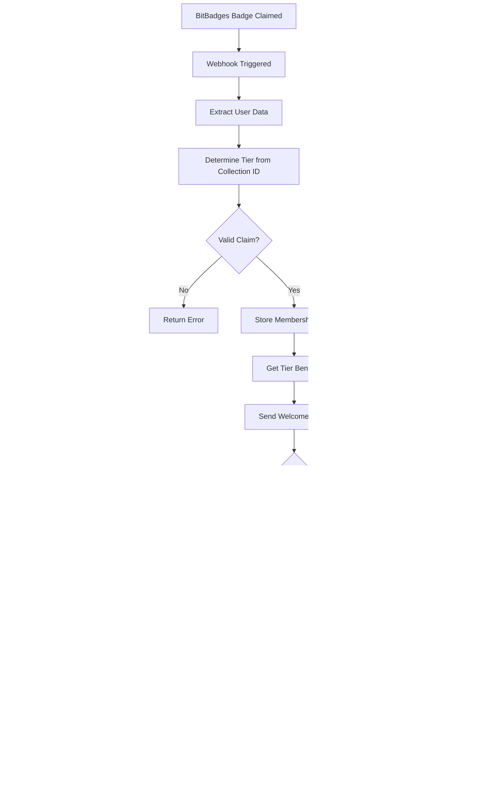

# NFT Treasury Project Flowchart

## Main Application Flow

## Membership Verification Flow

## NFT Purchase Flow

## Backend Webhook System

## Tier System Architecture

## Technology Stack Integration

## Security & Access Control Flow

This comprehensive flowchart shows how your NFT Treasury project implements a secure, decentralized membership system using blockchain verification, tiered access control, and automated benefit distribution.
